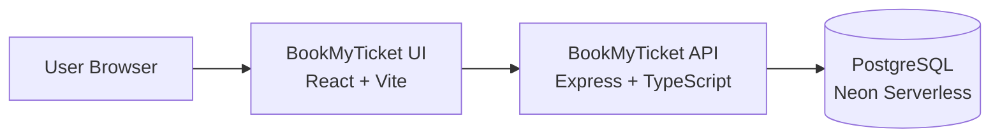
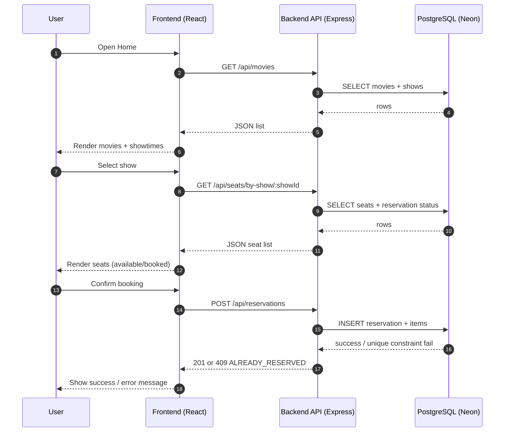

---

## Frontend Repository (BookMyTicket UI)

### Live Demo

Frontend (Vercel): `https://seat-reservation-assessment-ui.vercel.app/`

### Tech Stack

* React + Vite
* TypeScript
* Tailwind CSS
* (Optional) Axios / Fetch for API calls

---

## Local Setup & Run

### 1) Prerequisites

* Node.js **18+** (recommended)
* npm (or yarn/pnpm)

### 2) Install & Run

```bash
git clone <GITHUB_FRONTEND_REPO_URL>
cd <frontend-folder>

npm install
npm run dev
```

Open:

* `http://localhost:5173`

### 3) Build & Preview

```bash
npm run build
npm run preview
```

---

## Environment Variables

Create a `.env` file in the frontend root:

```env
VITE_API_BASE_URL=http://localhost:4000/api
```

If backend is deployed (Render/Railway/etc), set it like:

```env
VITE_API_BASE_URL=https://<your-backend-domain>/api
```

---

## Architecture Diagram



---

## API Integration Flow



---

